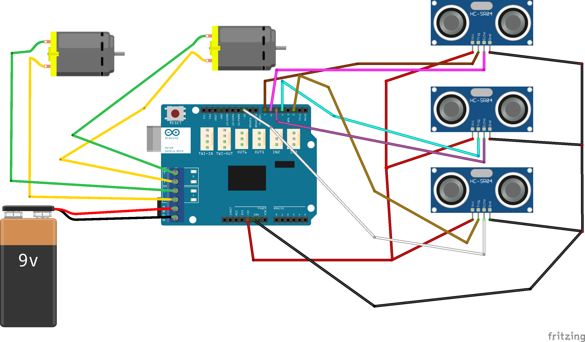

# Obstacle Avoider

## Description\
Simple bot which avoids obstacles using ultrasonic sensor.
## Components
- Arduino Uno
- Arduino Motor Shield
- 3 Ultrasonic Sensor
- 2 DC Motors
- Chasis
- Wheels
- 9V Battery
- switch on/off
## Circuit Diagram

## YT DIY movie
[Click here](https://www.youtube.com/watch?v=xhhiAN4H_Hg)
